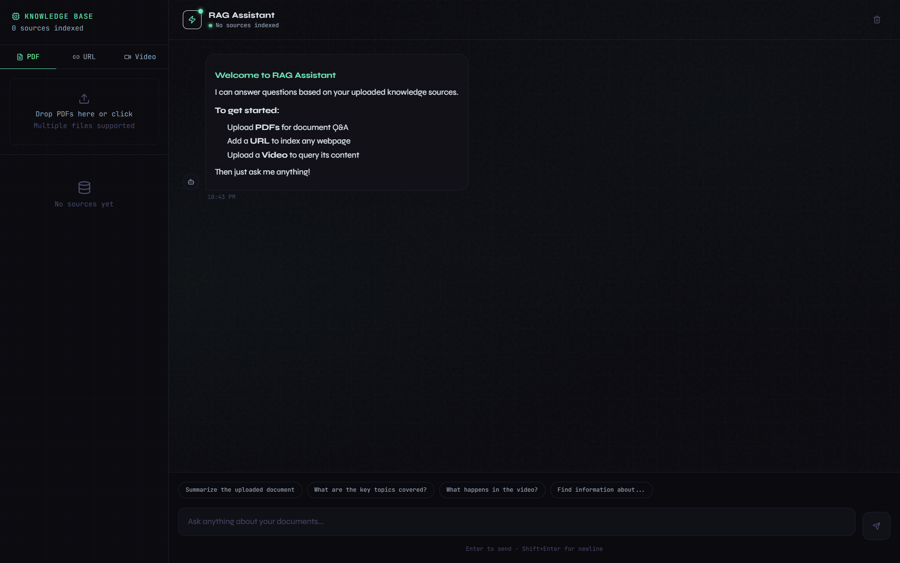

# RAG Assistant — Frontend

A multi-modal RAG (Retrieval-Augmented Generation) chat interface that lets you query knowledge sources including PDFs, URLs, and Videos using an AI assistant.



---

## Prerequisites

- [Node.js](https://nodejs.org/) v18 or higher
- [npm](https://www.npmjs.com/) v9 or higher
- The **multi-modal RAG backend** running locally at `http://localhost:8000`

---

## Backend Requirement

> ⚠️ **You must start the backend before running the frontend.**

This frontend connects to a multi-modal RAG agent API at `http://localhost:8000`. API calls are proxied through Next.js rewrites (`/api/backend/*` → `http://localhost:8000/*`), so the backend must be up before launching the dev server.

```bash
# Start the backend first
git clone git@github.com:Cowpacino/Dynamic-RAG.git
# follow backend setup steps, then:
python -m app.main
```

Once the backend is running and accessible at `http://localhost:8000`, proceed with the frontend setup below.

---

## Getting Started

### 1. Clone the repository

```bash
git clone git@github.com:Aryansahu28/multi-modal-rag-frontend.git
```

### 2. Install dependencies

```bash
npm install
```

### 3. Start the development server

```bash
npm run dev
```

The app will be available at [http://localhost:3000](http://localhost:3000).

---

## Project Structure

```
RAG-CHAT/
├── app/
│   ├── globals.css         # Global styles
│   ├── layout.tsx          # Root layout
│   └── page.tsx            # Main page
├── components/
│   ├── ChatInput.tsx       # Chat input bar
│   ├── ChatMessage.tsx     # Individual message renderer
│   └── UploadSidebar.tsx   # Knowledge base sidebar (PDF / URL / Video)
├── lib/                    # Utility functions / API helpers
├── next.config.js          # Next.js config with backend proxy rewrites
├── tailwind.config.js      # Tailwind theme (custom colors, fonts, animations)
├── postcss.config.js
├── tsconfig.json
├── package.json
└── README.md
```

---

## Features

| Source Type | Description |
|-------------|-------------|
| 📄 **PDF** | Upload one or more PDF files for document Q&A |
| 🔗 **URL** | Add any webpage URL to index its content |
| 🎬 **Video** | Upload a video file to query its content |

- **Knowledge Base panel** — manage all indexed sources from the left sidebar
- **Chat interface** — ask anything about your uploaded documents
- **Quick prompts** — one-click starter questions (Summarize, Key topics, etc.)
- Real-time source count indicator in the header

---

## Scripts

| Command | Description |
|---------|-------------|
| `npm install` | Install all dependencies |
| `npm run dev` | Start the development server on port 3000 |
| `npm run build` | Build for production |
| `npm run start` | Start the production server |
| `npm run lint` | Run ESLint |

---

## Tech Stack

- **Next.js 14** — React framework with App Router and API proxy rewrites
- **React 18** — UI library
- **TypeScript** — Type-safe development
- **Tailwind CSS** — Utility-first styling with custom theme
- **lucide-react** — Icon library
- **react-markdown** + **remark-gfm** — Markdown rendering in chat messages

---

## Troubleshooting

**Frontend loads but chat returns errors**
→ Ensure the backend is running at `http://localhost:8000` before using the app.

**Port conflict on startup**
→ Next.js defaults to port 3000. If it's taken, pass a different port: `npm run dev -- -p 3001`.

**No sources indexed after upload**
→ Check the browser console and backend logs for connection or parsing errors. Confirm the proxy rewrite in `next.config.js` is pointing to the correct backend URL.
